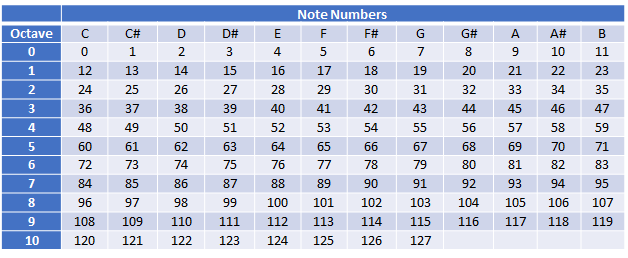

# Music Generator
The project found in this repository uses music theory and the [Java MIDI library](https://docs.oracle.com/en/java/javase/17/docs/api/java.desktop/javax/sound/midi/package-summary.html) to generate music which adheres to scales, and consists of chords, melodies and bass lines. The music is multi instrumental, and because it is in MIDI format it can be imported to digital audio workstations like FL Studio or Logic Pro.

## Song Structure
Songs are comprised of a hierarchy of classes, shown in the following diagram: 

 Track -> segment -> Bar -> Beat -> Note" src="Media/SongClassStructure.png">

For each component in the structure, the subcomponent has a many to one relationship with the parent component, I.E. a song has many segments, a segment has many bars and so on. The structure of songs in this project allows for the repetition of choruses, like in most songs. At the bottom of the hierarchy, notes contain an integer value corresponding to a MIDI note number value. MIDI note numbers represent notes and their octaves.

### Songs
The song class all of the data relating to the song. It contains an array of Tracks, which themselves contain the song data.

### Tracks
Tracks represent the [MIDI component](https://docs.oracle.com/javase/8/docs/api/javax/sound/midi/Track.html) of the same name. Each track is given a track type, which dictates how notes are generated for the track. For example, in a track which represents chords, notes will be generates as spanning over one subdivision, with multiple notes playing together at once in harmony. In contrast, tracks of the melody track type have notes generated with different behaviours, such as having multiple notes over a subdivision, and only ever having one note played at a time.

### Segments
Segments represent large segments of songs like [choruses](https://en.wikipedia.org/wiki/Refrain) and verses. They are made up of multiple bar objects.

### Bars
Bars represent their [equivalent](https://en.wikipedia.org/wiki/Bar_(music)) of the same name in song structure. By default, the number of beats in a bar is 4, however this can be configured differently to generate music in different time signatures.

### Beats
The Beat class represents data which would occur on a given beat in the song, namely it contains a two dimensional array of notes. The first dimension represents the number of subdivisions to be played, and the second dimension represents the number of notes that are played simultaneously. For example, chords are typically played over one subdivision, but have multiple notes played simultaneously. A melody on the other hand will typically have one note played at a time, but will have multiple notes played on a beat.

### Notes
Musical notes are represented by an enumerator with the same name. The values of the 'Note' enumerator range from A to G#, like in the [Chromatic scale](https://en.wikipedia.org/wiki/Chromatic_scale).

## Generating Music
The SongGenerator class is responsible for generating music. The newSong function causes the object to generate and return a new song.

### Song properties
Songs are generated by first generating the properties of the song, namely the scale, track structure and the song structure. The track structure is represented by an enumerator, and the values are in the format of a string. Each character of the string represents a different track to be created, with the character itself being used to determine how notes are generated, so that the track can fulfill its role in the song. The three current track types are 'M' for melody, 'C' for chord, and 'B' for bass. Song structure is represented in the same way, but is used to determine how many segements there should be, and of what type. The different types of segment are 'C' for chorus, 'V' for verse, 'B' for bridge and 'I' for intro.

### Song contents
After generating the properties of the song, the SongGenerator class then goes on to use these properties in the generating of the music. The public function createSong is the function used to trigger the generation of music, which it then returns. 

## Converting to MIDI
The MidiGenerator class is responsible for converting song objects to MIDI sequences. The public function "generateMidi()" loops through the structure of the song and converts each note value into MIDI events to start and stop playing notes. The function returns a [MIDI Sequence](https://docs.oracle.com/javase/8/docs/api/javax/sound/midi/Sequence.html) object.